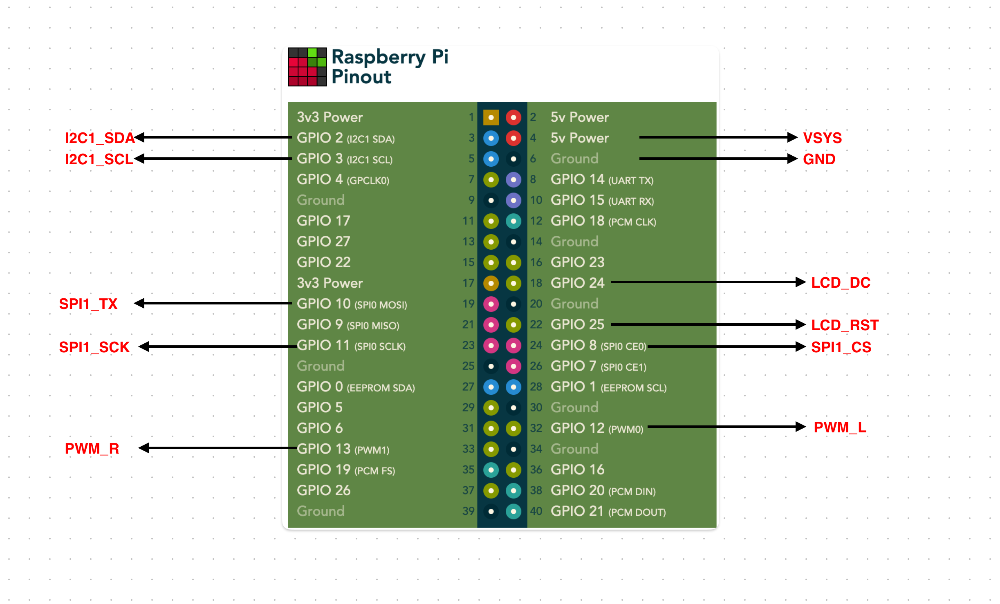
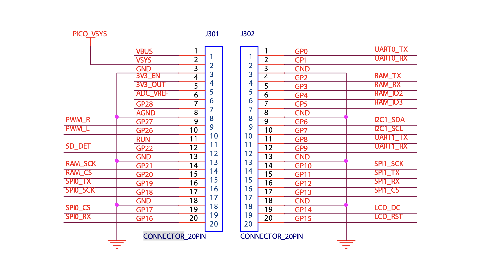
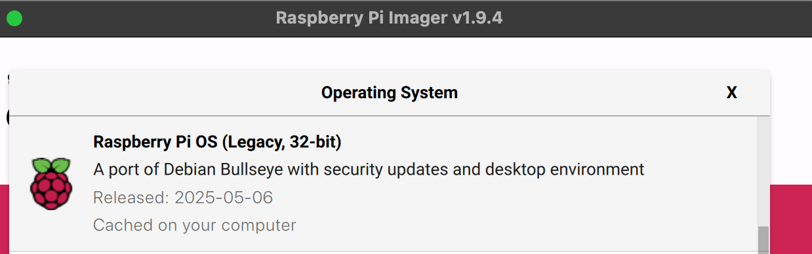

## Guide for Setup Pi Zero 2 on Picocalc

#### Set up wire connection 

Connect your PicoCalc to the Raspberry Pi Zero 2:

| **Picocalc Pin** |**Raspberry Pi Pin** | **Pi Pin Number** |
|-------------|----------------------|----------------|
| **VDD**     | 5V                   | Pin 2 or Pin 4 |
| **GND**     | Ground               | Pin 6          |
| **LCD_DC**  | GPIO 24              | Pin 18         |
| **LCD_RST** | GPIO 25              | Pin 22         |
| **SPI1_CS** | GPIO 8               | Pin 24         |
| **SPI1_TX** | GPIO 10              | Pin 19         |
| **SPI1_SCK**| GPIO 11              | Pin 23         |
| **I2C1_SDA**| GPIO 2               | Pin 3          |
| **I2C1_SCL**| GPIO 3               | Pin 5          |
| **PWM_R**   | GPIO 13              | Pin 33         |
| **PWM_L**   | GPIO 12              | Pin 32         |




Connector Schematic on clockwork_Mainboard_V2.0_Schematic. Please note it is Left-Right mirrored!




#### Install the correct OS 

Please make sure your OS is Legacy 32-bit Bullseye Raspberry Pi OS.




#### Download the repository

```bash
sudo apt update
sudo apt install -y git
git clone https://github.com/wasdwasd0105/picocalc-pi-zero-2.git
```


#### Install Display driver FIRST

```bash
cd ./picocalc-pi-zero-2
chmod +x ./setup_display.sh
sudo ./setup_display.sh
```
Wait for some time, it will reboot after installed

#### Install Keyborad driver

```bash
cd ./picocalc-pi-zero-2
chmod +x ./setup_keyboard.sh
sudo ./setup_keyboard.sh
```
Please reboot after installed


#### Install Audio

Edit /boot/config.txt (with sudo) and add:

```bash
dtparam=audio=on
dtoverlay=audremap,pins_12_13
```

Please reboot after installed