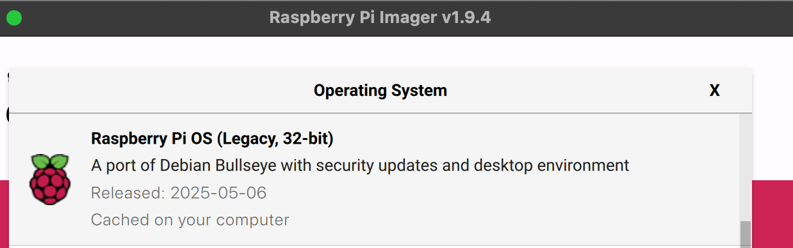

# Guide for Setup Pi Zero 2 on Picocalc

## Tips
1. You can change UI size on Preference → Appearance Settings → Defaults
2. The Pico Connectors on clockwork_Mainboard_V2.0_Schematic are Left-Right flipped!
3. It's best to connect to Pi via SSH
4. Consider using lite (headless) OS

## Wiring
Connect your PicoCalc to the Raspberry Pi Zero 2:

| **Pin Name** |**Raspberry Pi Pico/PicoCalc** | **Raspberry Pi Zero 2** |
|-------------|----------------------|----------------|
| **VDD**     | VSYS - GP39          | Pin 2 or Pin 4 |
| **GND**     | GND - GP38           | Pin 6          |
| **LCD_DC**  | GP14                 | Pin 18         |
| **LCD_RST** | GP15                 | Pin 22         |
| **SPI1_CS** | GP13                 | Pin 24         |
| **SPI1_TX** | GP11                 | Pin 19         |
| **SPI1_SCK**| GP10                 | Pin 23         |
| **I2C1_SDA**| GPI6                 | Pin 3          |
| **I2C1_SCL**| GPI7                 | Pin 5          |
| **PWM_R**   | GP27                 | Pin 33         |
| **PWM_L**   | GP26                 | Pin 32         |


Connector schematic from PicoCalc's oficial repo, [link](https://github.com/clockworkpi/PicoCalc/blob/master/clockwork_Mainboard_V2.0_Schematic.pdf). Please note it is Left-Right flipped!

## Installing os
**Please make sure your OS is Legacy 32-bit Bullseye Raspberry Pi OS.**


## Configuring Pi Zero
1. Download the repository   
```bash
sudo apt update
sudo apt install -y git
git clone https://github.com/wasdwasd0105/picocalc-pi-zero-2.git
```

2. Install Display driver **FIRST**   
```bash
cd ./picocalc-pi-zero-2
chmod +x ./setups/setup_display.sh
sudo ./setups/setup_display.sh
```
*Wait for some time, it will reboot after installed*   

3. Install Keyborad driver
```bash
cd ./picocalc-pi-zero-2
chmod +x ./setups/setup_keyboard.sh
sudo ./setups/setup_keyboard.sh
```
**Please reboot after installed**    

4. Install Audio
Edit `/boot/config.txt` (with sudo) and add:
```bash
dtparam=audio=on
dtoverlay=audremap,pins_12_13
```
**Please reboot after installed**
